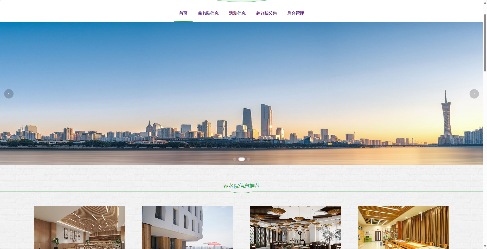
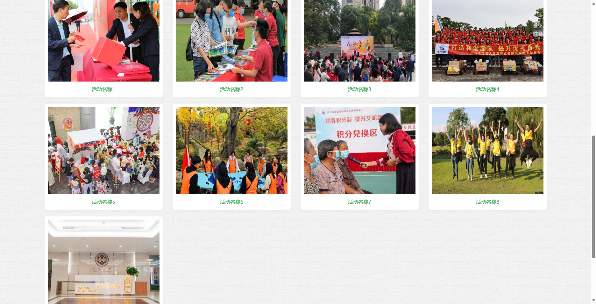
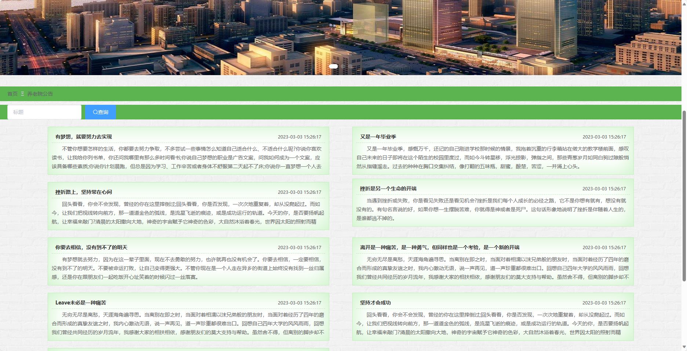
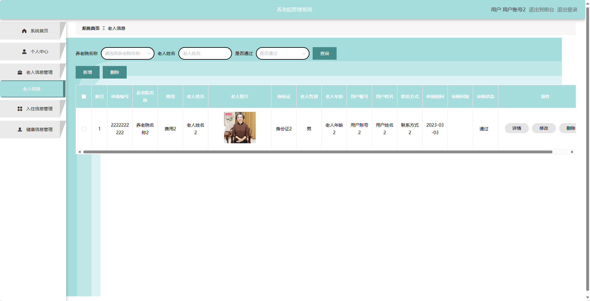
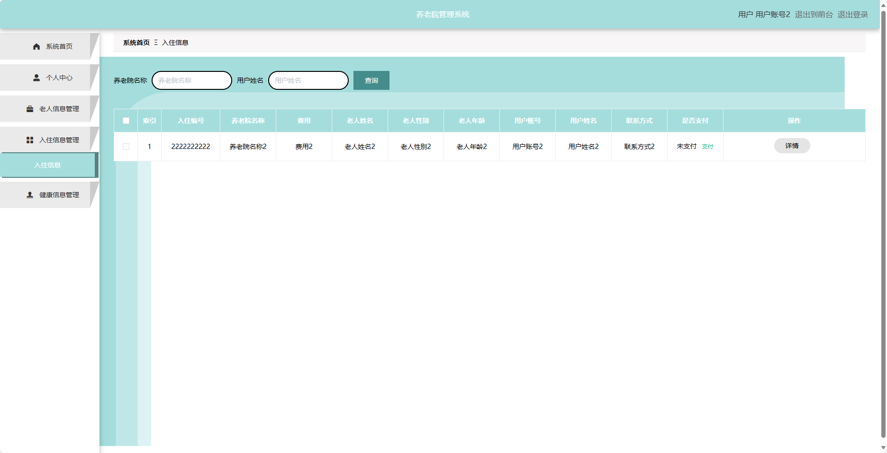
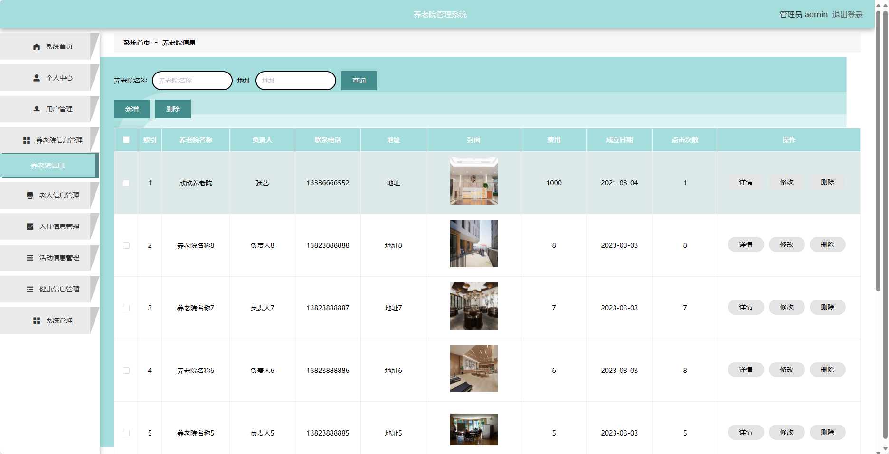
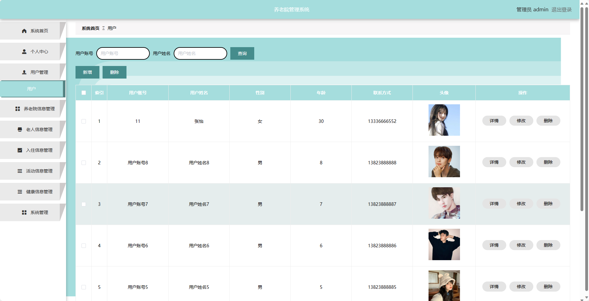
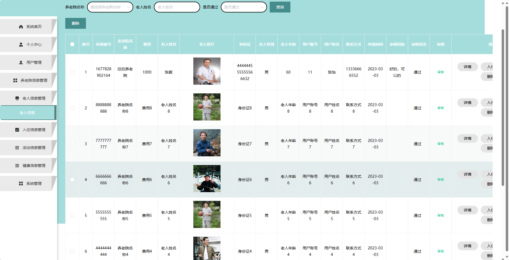
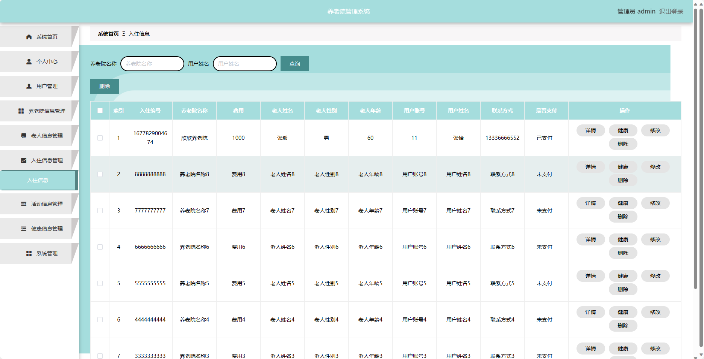

## 基于SpringBoot的养老院管理系统

###  获取sql数据库文件: 从戎源码网 (https://armycodes.com/) QQ: 386869957 QQ群: 377586148
###  所有系统地址: (https://github.com/YuLin-Coder/AllProjectCatalog) 
###  所有项目以及源代码本人均调试运行无问题 可支持远程安装部署调试、定制修改、代码讲解

## 项目介绍
基于SpringBoot的养老院管理系统，系统包含两种角色：管理员、用户,系统分为前台和后台两大模块，主要功能如下。

### 【管理员】:
- 个人中心：管理员可以管理个人信息，修改密码等。
- 用户管理：管理员可以管理用户的信息，包括添加、编辑和删除用户信息。
- 养老院信息管理：管理员可以管理养老院的信息，包括添加、编辑和删除养老院信息。
- 老人信息管理：管理员可以管理老人的信息，包括添加、编辑和删除老人信息。
- 入住信息管理：管理员可以管理老人的入住信息，包括添加、编辑和删除入住信息。
- 活动信息管理：管理员可以管理养老院的活动信息，包括添加、编辑和删除活动信息。
- 健康信息管理：管理员可以管理老人的健康信息，包括添加、编辑和删除健康信息。
- 系统管理：管理员可以设置系统的基本信息，包括养老院名称、联系方式等。

### 【用户】:
- 个人中心：用户可以管理个人信息，修改密码等。
- 老人信息管理：用户可以管理自己的老人信息，包括添加、编辑和删除老人信息。
- 入住信息管理：用户可以管理自己老人的入住信息，包括添加、编辑和删除入住信息。
- 健康信息管理：用户可以管理自己老人的健康信息，包括添加、编辑和删除健康信息。

### 【前台】:
- 首页：展示养老院的概述信息、推荐活动等内容。
- 养老院信息：用户可以查看养老院的详细信息。
- 活动信息：用户可以查看养老院的活动信息。
- 养老院公告：用户可以获取最新的养老院相关公告信息。
- 个人中心：用户可以管理个人信息、查看老人信息、入住信息和健康信息。

## 项目技术
- 编程语言：Java
- 数据库：MySQL
- 项目管理工具：Maven
- 前端技术：HTML、CSS、JavaScript、Jquery、Vue
- 后端技术：Spring、SpringMVC、MyBatis

## 运行环境
- JDK版本：JDK1.8及以上
- 开发工具：IDEA、Ecplise、Myecplise都可以
- 数据库: MySQL5.7及以上
- Maven：maven3.0及以上
- Node：14.14.0及以上

## 运行截图

